# LumaShot — 开发预览版

**轻巧、原生的 Windows 截图工具：** 截图标注、长截图、置顶贴图、离线 OCR、GIF 与屏幕录制，一个托盘程序全部搞定。

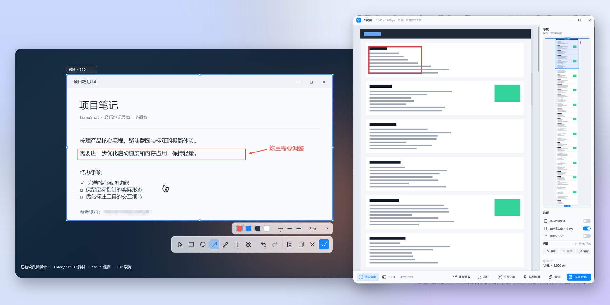

- **截图与标注** — 框选区域 / 窗口 / 控件，矩形、箭头、画笔、荧光笔、文字、序号、马赛克，Acrylic 工具栏与深浅主题。
- **长截图** — 自动或手动滚动拼接，独立预览窗口可缩放、裁剪，并能在长图上**非破坏式标注**。
- **置顶贴图 + 离线 OCR** — 贴图可继续标注、选择复制文字，识别表格并粘贴到 Excel，全程本地运行。
- **截图翻译** — `Ctrl+Alt+Y` 框选即翻译，译文直接覆盖在贴图上；支持内置离线翻译（设置里一键下载混元 / TranslateGemma 模型，不联网、无需密钥）、本地 Ollama / LM Studio 与 DeepSeek、通义、DeepL、百度、有道、腾讯等 API，只发送识别出的文字。
- **GIF 与录屏** — 区域 / 窗口 / 全屏录制，GIF 时间轴裁剪，MP4 默认 AV1 压缩。
- **原生而克制** — C++20 + Win32 + Direct2D，待机不截图、不绘制，无需管理员权限。

## 界面预览

| 截图标注（浅色） | 截图标注（深色） |
| :---: | :---: |
| 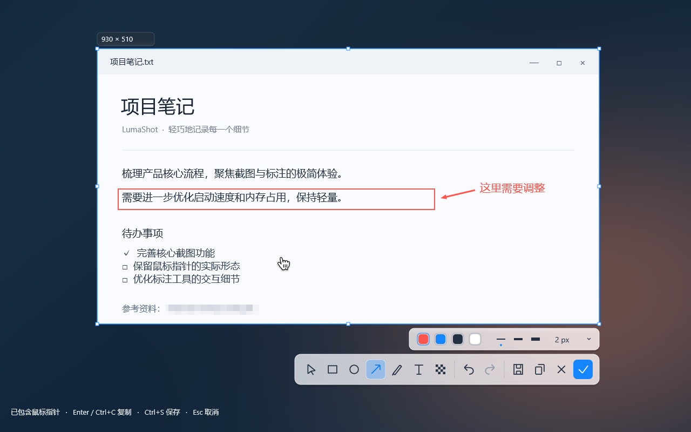 | 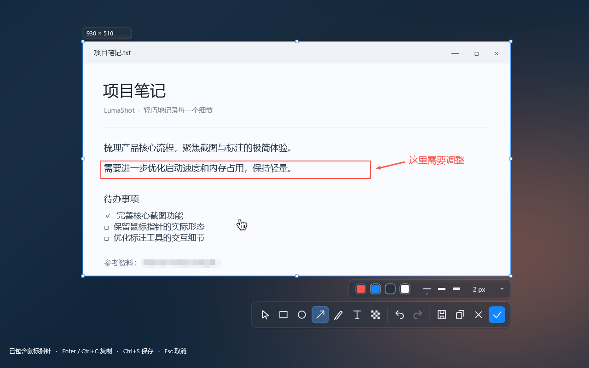 |
| **标注属性面板** | **荧光笔** |
| 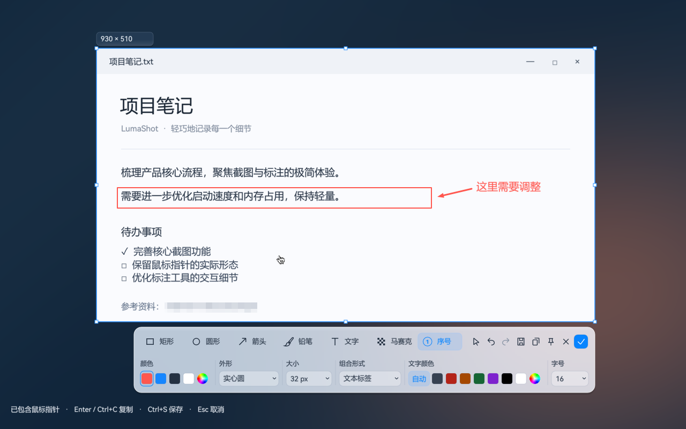 | 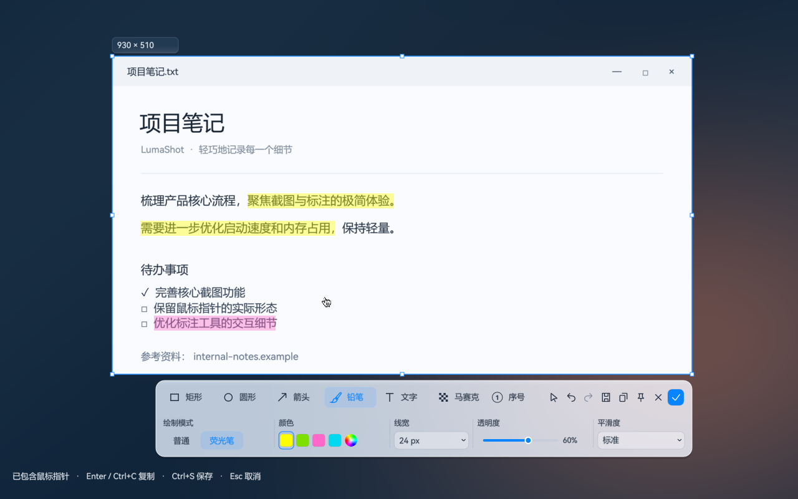 |
| **长截图预览与标注** | **在长图可见段上直接标注** |
| 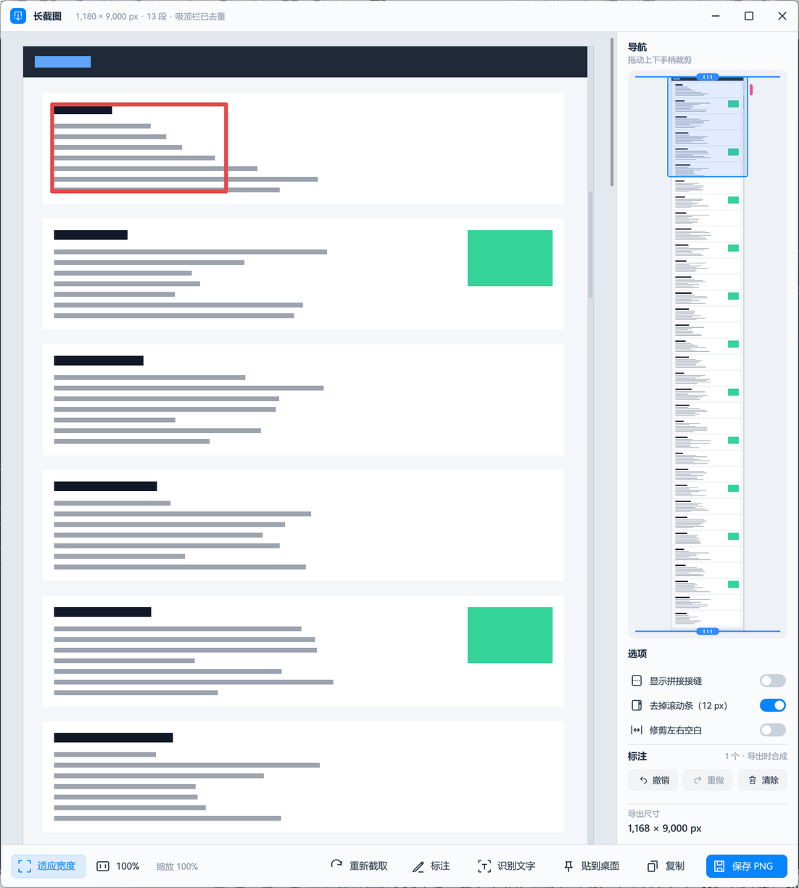 | 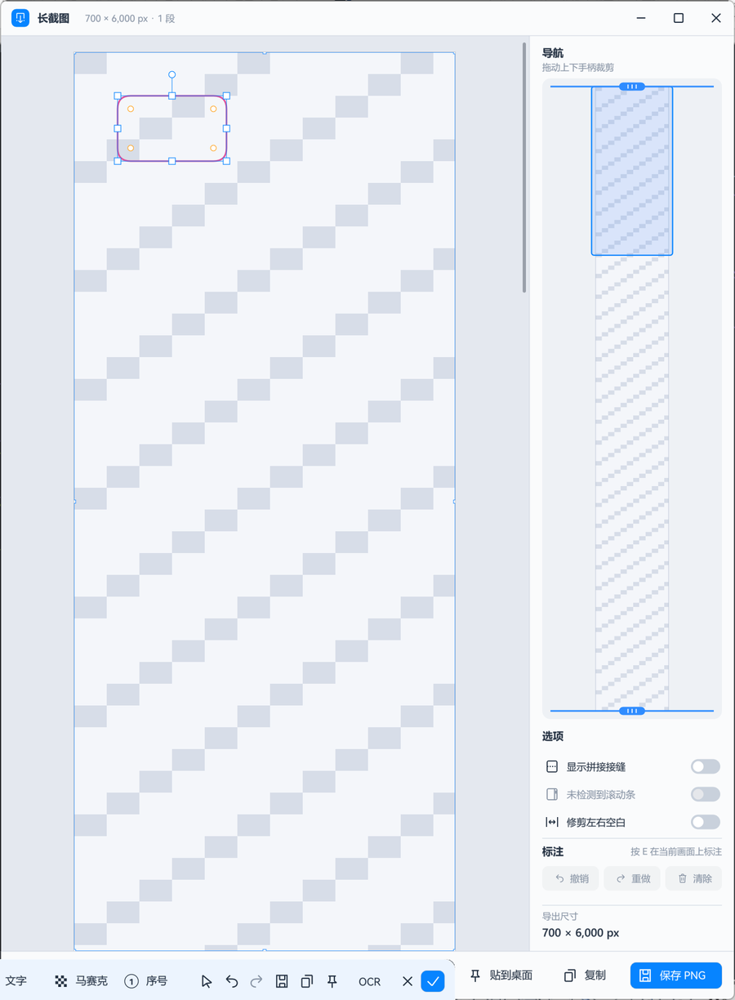 |
| **GIF 录制预览与裁剪** | **置顶贴图菜单** |
| 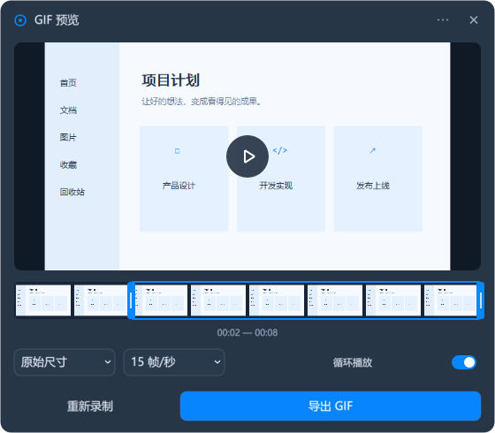 | 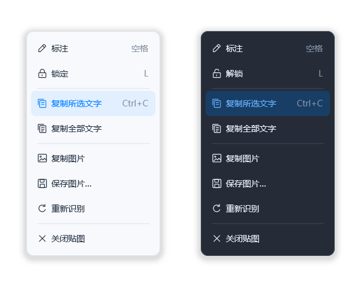 |
| **设置（浅色）** | **设置（深色）** |
| 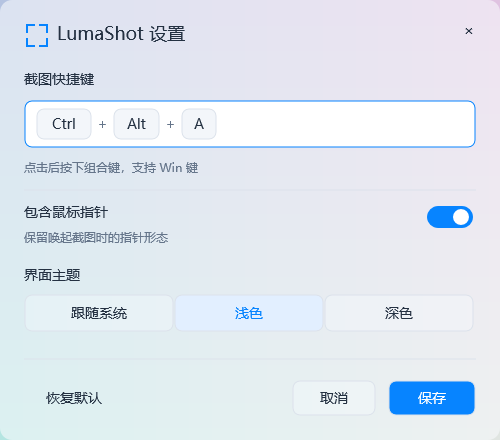 | 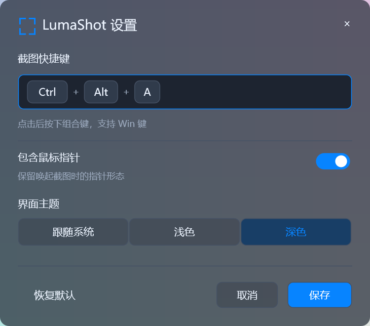 |

> 以上截图均由测试程序使用合成内容生成，不包含任何个人数据。

## 下载、安装与升级

在 [GitHub Releases](https://github.com/jimmgreen/LumaShot/releases) 下载
`LumaShot-Setup.exe`，支持 Windows 10/11 x64，无需管理员权限。
当前版本为 **v0.2.0**，仍属于开发预览阶段。

手动升级时，下载新版安装包并安装到原目录即可，不必先卸载（v0.1.0 没有应用内更新，需要这样手动安装一次 v0.2.0）。
安装程序会请求旧版本正常退出、更新文件并重新启动，保留用户设置。
从 0.2.0 起，应用内置更新：启动后每天最多自动检查一次（可在设置中关闭），也可从托盘菜单或设置中「检查更新」。
发现新版本后先提示，确认后才下载；无法直连 GitHub 时会自动改用 GitHub 文件加速代理。
更新信息带 ECDSA 签名，安装包按签名中的 SHA-256 校验，校验通过并再次确认后静默安装并重启。详见 [应用内更新](docs/updater.md)。
安装包尚未进行代码签名。下载后可用同一 Release 的 `SHA256SUMS.txt` 校验文件。

LumaShot 自有代码采用 [MIT 许可证](LICENSE)，第三方组件保留各自许可证，
详见 [第三方说明](THIRD-PARTY-NOTICES.md)。Release 中的
`LumaShot-ffmpeg-source.zip` 为 FFmpeg 对应源码，普通用户安装时无需下载。

文字渲染已接入预编译的 LumaText DLL，只依赖二进制与公共头文件，不引用
完整项目。构建和打包自动携带 DLL，详见 [接入说明](docs/lumatext-integration.md)。

独立的 Windows 10/11 x64 截图工具，使用 C++20、Win32、Direct2D、DirectWrite 与 WIC。

## 使用

新增 **GIF 与屏幕录制**：设置中可分别修改 `Ctrl+Alt+G` 和 `Ctrl+Alt+R`，托盘也提供入口。快捷键先打开准备工具条，选择区域/窗口/全屏，点击开始后倒计时录制。录制中可暂停和停止；结束后预览，GIF 可拖动时间轴两端裁剪后导出，视频保存为 MP4。更多菜单可选择兼容编码；默认要求实际硬件编码可用。请保留同目录下的 `lumashot_recording_worker.exe`。已实现范围、性能数据与未验证事项见 [录制实现与验证](docs/recording-implementation.md)。

MP4 保存默认采用体积优先的 **AV1** 压缩，保留原尺寸、帧时间与音轨；保存提示显示实际编码和缩小比例，无法压缩时会明确提示保留原文件。AV1 导出需要更多时间，部分播放器需要 AV1 解码支持；录制面板预览仍使用原始缓存。质量取舍、回退规则和运行时说明见 [MP4 导出压缩](docs/mp4-export-compression.md)。

双击 `LumaShot.exe` 开始截图，取消或完成后程序留在托盘。默认快捷键是 **Ctrl+Alt+A**，可从托盘设置中修改。

- 拖动框选区域，单击选择悬停窗口；未选区时按 `F` 选择当前屏幕，`A` 选择全部屏幕。
- 选区内使用矩形、椭圆、箭头、画笔、文字和马赛克。`V` 切换选择工具，拖动选区边缘调整范围，直接单击已有标注会自动切换到选择工具并选中，可立即拖动、修改属性或删除；空白处继续使用当前绘制工具。
- 箭头类型选择“手绘箭头”后，算法会根据主要走向整体拟合曲线，自动整理局部鼓包、小折返和多余拐点；起终点保持固定，箭头沿最终曲线方向衔接。原始轨迹保留用于编辑、撤销和重做。
- 画笔属性板可直接选择“自由画笔 / 直线 / 连续直线”，普通笔和荧光笔均可使用，无需 Shift。连续直线逐点点击，双击、Enter 或右键完成；Backspace / Ctrl+Z 撤回一点，Esc 取消当前折线。捕捉开关支持端点、中点、线段最近点和水平/垂直/45° 辅助；连续绘制使用小顶点与几何捕捉符号，不显示浮动文字。中点和最近点适用于直线、折线和直线型箭头；点击已有标注优先连接，按 V 编辑标注。详见 [连续直线与捕捉](docs/mcp-pen-polyline-snap.md) 及 [紧凑光标与捕捉改进](docs/mcp-snap-refinement.md)。
- **马赛克：选择棋盘图标或按 M，然后按住左键涂抹。** 单击、水平和竖直涂抹均有效。三个圆圈控制笔刷范围，右侧下拉调整颗粒大小。纯色区域的马赛克可能保持同色。
- 文字：单击输入，`Enter` 确认文字，`Shift+Enter` 换行；右侧下拉调整字号。文字输入使用截图背景，不显示白底。双击已有文字重新编辑。
- `Ctrl+Z` 撤销，`Ctrl+Y` 重做，`Delete` 删除选中标注。
- `Enter` / `Ctrl+C` 复制并完成，`Ctrl+S` 保存 PNG，`Esc` / 右键取消。
- 默认保留唤起时的鼠标指针，包括箭头、手形、文本光标和缩放光标。可在托盘关闭；指针不在选区内时不会出现在裁切结果中。
- **置顶贴图与离线 OCR：** 框选并标注后，点击图钉创建普通置顶贴图，不自动识别；点击相邻的 **OCR** 按钮创建识别贴图。普通贴图也可右键“识别文字”。拖选识别文字后按 `Ctrl+C`，贴图会保留以便再次复制。
- 贴图中双击选择英文单词或连续中文，三击选择整行，`Ctrl+A` 全选，`Esc` 清除选择。贴图没有标题栏；双击空白处关闭。拖动空白处移动窗口；文字铺满时使用 `Space+拖动`。右键可查看识别状态、复制全部文字、复制图片、保存图片、重新识别或关闭。
- 检测到可靠的规整表格时，右键额外显示“复制表格”，粘贴到 Excel 后按行列排列并保留内部空单元格；普通文字或无法确定结构时仅提供文字复制。表格分析完全本地运行，不推断合并单元格。
- OCR 处理已经应用标注的图像，识别前去除采样鼠标；显示与图片导出仍保留原有鼠标设置。文字高亮不会进入导出图片。
- 托盘菜单提供 3 秒延时截图；延时结束时采样指针。

### 截图翻译

- 按 `Ctrl+Alt+Y`（可在设置中修改）框选区域，或在截图工具栏点“截图翻译”、在贴图右键菜单选“翻译”/按 `T`。贴图会显示覆盖好译文的图片，旁边的翻译面板逐段列出原文与译文，可复制译文或双语文本、临时切换目标语言、在译文图与原图之间切换。
- 首次使用会打开“翻译引擎设置”：默认是**离线翻译**，按本机内存与显卡推荐模型（混元翻译 1.5 · 1.8B / 7B、TranslateGemma 4B），点“下载”即可，支持暂停续传与 SHA-256 校验，文字不离开电脑；本地 Ollama / LM Studio 自动检测、无需密钥；也可填写 DeepSeek、通义千问、硅基流动、智谱、Kimi、OpenAI、DeepL、百度、有道或腾讯云的密钥（DPAPI 加密保存）。详见 [截图翻译说明](docs/screenshot-translation.md)。

### 长截图（滚动拼接）

- 截图框选后点击工具栏的长截图按钮（或按 `L`），LumaShot 会在选区内**自动滚动**并实时拼接；滚动鼠标滚轮即切换为**手动滚动**。
- 拼接工具条：`Space` 暂停 / 继续，`A` 切换自动 / 手动，`S` 调整速度，`Backspace` 撤回最后一段，`Enter` 完成，`Esc` 取消。右侧面板实时显示拼接预览、高度与预计大小，默认最大高度 30 000 px。
- 完成后打开独立的**长截图预览窗口**：适应宽度 / 100%、`Ctrl+滚轮` 缩放、拖动平移；缩略图导航上拖动手柄裁剪起点与终点，可显示拼接缝、去掉滚动条、修剪左右空白；支持复制、保存 PNG、贴到桌面和识别文字。
- **长图标注：** 点击「标注」或按 `E`，当前可见的那一段会在熟悉的截图编辑器中打开（全部标注工具可用），`Enter` 完成、`Esc` 取消，可反复进入并再次编辑已有标注。标注不修改原图，只在复制 / 保存 / 贴图时合成；`Ctrl+Z` / `Ctrl+Y` 撤销重做，有未导出的标注时关闭窗口会先确认。
- 设计与实现细节见 [长截图说明](docs/long-capture.md)。

GIF 和视频录制均不设固定时长上限，由你手动停止；磁盘不足、设备故障等安全保护仍然生效。

## 视觉与资源使用

工具栏使用冻结截图的局部模糊与半透明着色实现 Acrylic 外观，并支持深浅主题。待机不持续截图、不持续绘制。

截图准备期间会在后台识别窗口里的按钮、输入框、列表和面板，悬停后可单击框选更小的区域；手动拖选方式不变。识别不阻塞截图显示，尚未识别或应用未公开控件时退回整窗框选。只读取控件边界与类型，不读取控件文字；识别进程按次启动，超时或取消后退出。

设置中“截图粘贴为文件”默认开启，格式可选 PNG（默认、无损）、JPEG 或 BMP。复制截图或贴图时同时提供图片和文件，支持粘贴到资源管理器；关闭后只提供图片。编码在后台完成，已复制文件保留在系统临时目录的 LumaShot-Clipboard 文件夹，避免关闭截图后粘贴失效；未发布的取消结果自动删除。超过 24 小时的 `LumaShot-*` 文件会在下次导出和程序启动时清理（当前剪贴板上的文件除外）。

**剪贴板历史（默认关闭）：** 设置中开启“开启剪贴板”后，屏幕右侧出现可折叠计数条；点击或按 `Win+V`（可在设置“快捷键 → 剪贴板”中修改或清除）打开搜索、分类、收藏、自定义分组和预览面板。不需要侧边条时，拖动它，屏幕底部中央会出现 × 关闭区，拖到上面松开即可隐藏；剪贴板仍在记录，快捷键和托盘菜单“剪贴板”照常可用。在托盘菜单勾选“显示剪贴板侧边条”或在设置中打开“显示剪贴板侧边条”即可恢复；剪贴板关闭时，托盘菜单会提供“开启剪贴板”。支持文本、图片与文件路径的复制/粘贴：普通记录滚动保留 100 条；收藏和分组中的记录不会被挤掉，另计最多 200 条；总计 128 MB，单条 16 MB。标签栏“收藏”之后是自定义分组（最多 20 个，点“＋”新建，右键分组标签可重命名/换色/删除）；选中记录按 `Ctrl+1…9` 移入分组、`Ctrl+0` 移出、`Ctrl+G` 打开分组菜单、`Ctrl+Shift+N` 新建并移入，`Alt+←/→` 切换标签。默认只保留本次运行的历史：内容以当前用户 DPAPI 加密暂存在 `%LOCALAPPDATA%\LumaShot\clipboard-history\session-{GUID}`，关闭功能或退出即删除。若在设置中打开“退出后保留剪贴板历史”（默认关闭），历史、收藏与分组会加密保存在 `clipboard-history\history-v1` 并在下次启动恢复；关闭该选项会删除已保存的历史，切换时当前列表会重新加载。面板“更多”菜单可随时清空。详见 [剪贴板说明与验证限制](docs/mcp-clipboard-history.md)。

设置窗口按“快捷键 / 截图 / 剪贴板 / 截图翻译 / 外观 / 通用”分页，左侧导航切换，每页无需滚动，并记住上次保存时所在的分页。设置保存在 `%LOCALAPPDATA%\LumaShot\settings.ini`（UTF-16 编码，旧的 ANSI 文件会在下次保存时自动转换，含中文或 emoji 的保存路径不再损坏）。**开机自启动默认开启**：首次运行即写入当前用户的 `Run` 启动项，可在设置中关闭“开机自启动”，关闭后立即移除。LumaShot 不上传截图。

录制进行中从托盘选择“退出”会先确认，可选择返回录制。录制临时文件位于系统临时目录的 `LumaShot-Recording`；若录制进程被强制结束，残留文件夹会在下次录制或程序启动时清理（正在使用的文件夹受租约文件保护，不会被删除）。

OCR 使用 PP-OCRv6 small FP32 与 ONNX Runtime CPU 1.22.0。普通截图和普通贴图不启动 OCR；用户主动识别的多张贴图共用一个后台进程，最多两条推理线程，空闲 30 秒后退出释放模型内存。图片与识别结果仅在内存中传递，不保存 OCR 历史。

便携发行目录为 `dist/LumaShot-ocr/`。请保留其中的 `ocr/`、`onnxruntime.dll`、`lumatext.dll`、`lumashot_ocr_worker.exe` 和 `lumashot_elements_worker.exe`，不能只复制主程序。

## 开发与验证

默认构建保留已注册的功能回归测试，包含跨一分钟的 GIF 录制用例。以下手动性能/诊断工具不再参与默认构建，
需要时使用 `cmake --build build --target <目标名>`：
`lumashot_selection_perf_test`、`lumashot_clipboard_perf_test`、
`lumashot_encoding_perf_test`、`lumashot_ocr_benchmark`、
`lumashot_profile`、`lumashot_profile_real`。
GIF 导出基准继续使用 `lumashot_gif_export_benchmark`（支持 1080p/4K，按需构建）。
测试建议从 `build/` 中运行，避免生成的媒体和预览图散落在项目根目录。
清理范围与验证结果见 [项目精简记录](docs/mcp-project-cleanup.md)。

使用安装了 C++ 桌面开发组件的 Visual Studio、CMake 3.25+、Ninja 和 Python 3，运行 `build.bat`。Python 仅用于构建时生成资源。

首次从源码构建，先运行 `powershell -File scripts/setup-ocr.ps1` 下载并校验固定版本的模型和 C++ 依赖；源站不可达时可加 `-Mirror`，下载内容仍按官方 SHA256 校验。运行和打包不需要 Python。完成构建后运行 `powershell -File scripts/package.ps1` 生成便携包。

- `build\lumashot_capture_test.exe`：鼠标热点、透明与单色掩码、负坐标、PNG 像素、资源释放。
- `build\lumashot_render_test.exe`：标注输出、马赛克单击/水平/竖直笔划、撤销重做、PNG、DPI 与窄屏布局。
- `build\lumashot_interactive_test.exe`：交互测试入口，使用合成内容，不读取个人桌面与设置。
- `build\lumashot_ocr_test.exe`：CTC 解码、Unicode 字符簇、选择范围和 IPC 数据校验；加 `--real` 检查实际模型识别。
- `build\lumashot_table_test.exe`：本地表格线、行列分析、空单元格、中英数字混排和协议校验；在项目根目录加 `--real` 检查浅色表头及空单元格的真实 OCR 结果。
- `build\lumashot_pin_test.exe`：合成贴图的真实鼠标消息、三击选行、DPI 切换、重试、关闭和 30 秒空闲释放；约 35 秒。
- `build\lumashot_ocr_service_test.exe`：真实子进程冷启动、取消旧任务、异常退出与恢复。
- `build\lumashot_pin_image_test.exe`：鼠标背景恢复、负坐标和马赛克处理顺序。
- `build\lumashot_capture_pin_test.exe`：使用合成截图点击实际置顶按钮，确认覆盖层关闭后贴图保留。
- OCR 性能工具按需构建：`cmake --build build --target lumashot_ocr_benchmark`，然后运行 `build\lumashot_ocr_benchmark.exe 100`，测量 100 张不同合成图片的字符错误率、热启动延迟与内存。
- `ctest --test-dir build --output-on-failure`：运行已注册的回归测试。详细测量范围和本轮提速对比见 `docs/ocr-verification.md`。
- `LumaShot.exe --render-demo <输出.png>`、`--render-demo-dark <输出.png>`：由实际绘制代码生成合成预览。
- `LumaShot.exe --tray`：只进入托盘；`--capture`：立即截图。

本轮修复前，水平、竖直和单击马赛克的三个新增回归用例失败；修复后通过。结果见 `docs/render-test-results.txt`，深浅色绘制预览见 `docs/implementation-preview*.png`。

当前仍为开发预览版。SDR 是验证范围；HDR 色彩准确性、真实多显示器混合 DPI 的完整交互和动画光标的当前帧尚未完成实机验证。窗口截图获取屏幕可见内容。

OCR 首版以横排印刷体为主，字符位置由 CTC 时间步估算，倾斜字、竖排、极小字和复杂表格不保证精确选字或排版。当前不提供贴图内再编辑、缩放和历史恢复。已覆盖合成 DPI 消息与物理像素映射，真实多显示器交互仍需实机验收。

工具栏属性支持跨截图及重启后恢复，详见 [属性保存](docs/tool-properties.md)。安装版构建方法见 [安装包说明](docs/installer.md)。